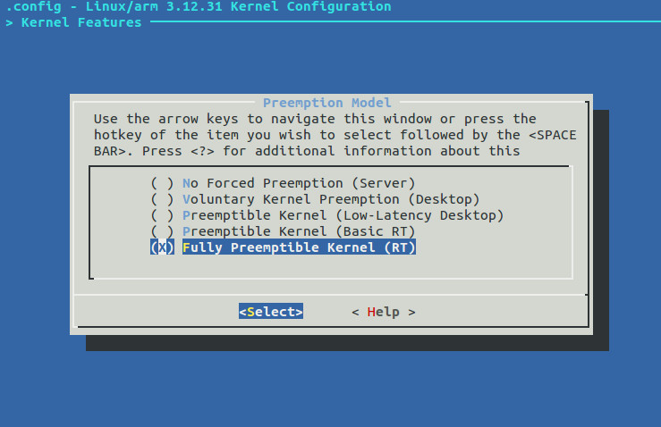
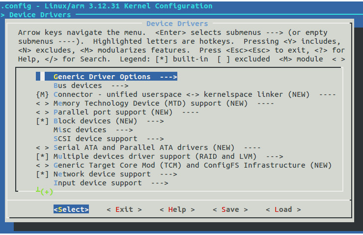

RaspbianRT
=================
Patch Raspbian OS with official Linux Real Time patches, compile and run into Raspberry Pi.

Features
========
* Raspbian Linux 3.12.31

* Patch RT 3.12.31-rt45

* Enable CONFIG_PREEMPT_RT.

* Diferent configuration real time modes.

* Enable/Disable drivers
  
  
  
  


Usage
=====
To run and compile Raspbian RT:

```groovy
  ./compile.sh
```
This generates two files:
  
    build/
        *|---> kernel.img   
        *|---> modules.tar.gz
        
  *Replace kernel.img in the boot partition
  
  *Unzip the modules in file system partition

```groovy
uname -a 
  Linux raspberrypi 3.12.31-rt45 #1 PREEMPT RT Wed Dec 17 06:46:40 EST 2014 armv6l GNU/Linux
```
# Download and install ciclyctest

Download ciclictest
```groovy
    git clone git://git.kernel.org/pub/scm/linux/kernel/git/clrkwllms/rt-tests.git 
```
Compile
```groovy
    cd rt-tests
    make all
```

# High resolution test with cyclictest

All tests have been run on Raspberry Pi 1 model B

* To generate synthetic load on the Raspberry Pi has used the command: 
```groovy
      cat /dev/zero > /dev/null
```
  This command writes zeros in null device, and puts the CPU 100% load.

Test case: clock_nanosleep(TIME_ABSTIME), Interval 10000 microseconds,. 10000 loops, no load.
```groovy
pi@raspberrypi ~/rt-tests $ sudo ./cyclictest -t1 -p 80 -n -i 10000 -l 10000
# /dev/cpu_dma_latency set to 0us
T: 0 ( 2573) P:80 I:10000 C:   9999 Min:     29 Act:   52 Avg:   46 Max:      80

```
Test case: clock_nanosleep(TIME_ABSTIME), Interval 10000 micro seconds,. 10000 loops, 100% load.
```groovy
pi@raspberrypi ~/rt-tests $ sudo ./cyclictest -t1 -p 80 -n -i 10000 -l 10000
# /dev/cpu_dma_latency set to 0us
T: 0 ( 2602) P:80 I:10000 C:  10000 Min:     28 Act:   50 Avg:   43 Max:      82
```
Test case: POSIX interval timer, Interval 10000 micro seconds,. 10000 loops, no load.
```groovy
pi@raspberrypi ~/rt-tests $ sudo ./cyclictest -t1 -p 80 -i 10000 -l 10000
# /dev/cpu_dma_latency set to 0us
T: 0 ( 2605) P:80 I:10000 C:  10000 Min:    107 Act:  161 Avg:  149 Max:     588
```
Test case: POSIX interval timer, Interval 10000 micro seconds,. 10000 loops, 100% load.
```groovy
pi@raspberrypi ~/rt-tests $ sudo ./cyclictest -t1 -p 80 -i 10000 -l 10000
# /dev/cpu_dma_latency set to 0us
T: 0 ( 2610) P:80 I:10000 C:  10000 Min:    118 Act:  149 Avg:  150 Max:     490
```
